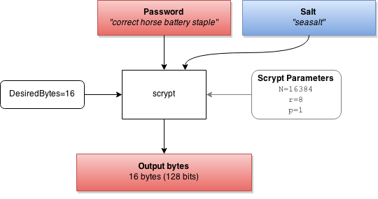

Scrypt for Delphi
=====================

[Scrypt](http://en.wikipedia.org/wiki/Scrypt) is a key derivation function. It is designed to take a password (and some salt), and generate a desired number of pseudo-random bytes. The generated bytes are usually then used as an symmetric encryption key. SCrypt is similar to [PBKDF2](http://en.wikipedia.org/wiki/PBKDF2), except that it is *memory-hard*, making it difficult to parallelize in hardware. 

It was first [described by Colin Percival in 2012](http://www.tarsnap.com/scrypt/scrypt.pdf) for the Tarsnap online backup service.

Sample Usage
----------------

To generate 16 bytes from a password (e.g. AES-128 key) using the default cost factors:

    secretKey := TScrypt.GetBytes('correct horse battery staple', 'seasalt', 16); //returns 16 bytes (128 bits)
    
To specify custom Scrypt parameters:

    secretKey := TScrypt.GetBytes('correct horse battery staple', 'seasalt', {N=2^}14}, {r=}8, {p=}1, 32); //returns 32 bytes (256 bits)

Password Hashing
--------------

The `TScrypt` class also supports being used for password hashing (i.e. storage and verification of passwords).

- To hash a password:

      hash := TScrypt.HashPassword('correct battery horse staple'); //using default cost factors
    
- To hash a password specifying your own cost factors:

      hash := TScrypt.HashPassword('correct battery horse staple', 14, 8, 1); //N=2^14, r=8, p=1
    
- To verify a password:

      isPasswordValid := TScrypt.CheckPassword('correct battery horse stapler', expectedHash);

By convention TScrypt outputs a password hash as string in the form:

    $7$Nrrrrrpppppsalt$hash

The parts of the string are:

| Value | Meaning | Notes |
|-------|---------|-------|
| 7 | Hash algorithm | "7" = current version of Scrypt |
| N | crypt base64 N log2 | Default is 14 (i.e. 2^14) iterations |
| rrrrr | crypt base64 r (little-endian 30 bits) |  |
| ppppp | crypt base64 p (little-endian 30 bits) |  |
| salt | raw salt | 0-43 bytes that should be limited to crypt base64 |
| hash | hash | crypt base64 encoded 32-byte scrypt hash (43 bytes) |

Because the three scrypt parameters are stored in the returned string, scrypt password hashes are backwards and forwards compatible with changing the factors. It also makes Scrypt extraordinarily convenient, in that a random salt is automatically generated and stored for you (you don't have to worry about storing it in a database or retrieving it).

Scrypt Operation
============

Scrypt uses three parameters to tune CPU and memory usage:

- **CostFactor**: determines how many blocks will have to be allocated in memory (the memory hard factor). 
      # of blocks = *"cost"* = N = 2^^costFactor
      Memory required =cost*blockSize = 2^^costFactor * blockSize

- **BlockSizeFactor**: determines the size of a *block* (`r`)
      BlockSize = blockSizeFactor * 128 bytes

- **ParallelizationFactor**: determines how many independant calculations have to be performed (`p`)

The default parameters given in the original whitepaper are:

- **CostFactor (cf)**: 14 (N = 2^^14 = 16,384)
- **Block Size Factor (r)**: 1 (blockSize = 1*128 bytes)
- **Parallelization Factor (p)**: 1

Note: Most scrypt documentation uses **Cost (N)**, which is a large value and a power of two. We adopt the BCrypt convention of expressing a **Cost Factor**, which is the log_2(Cost).
 

Created by Ian Boyd, 4/9/2015, and released into the [public domain](http://unlicense.org/)
